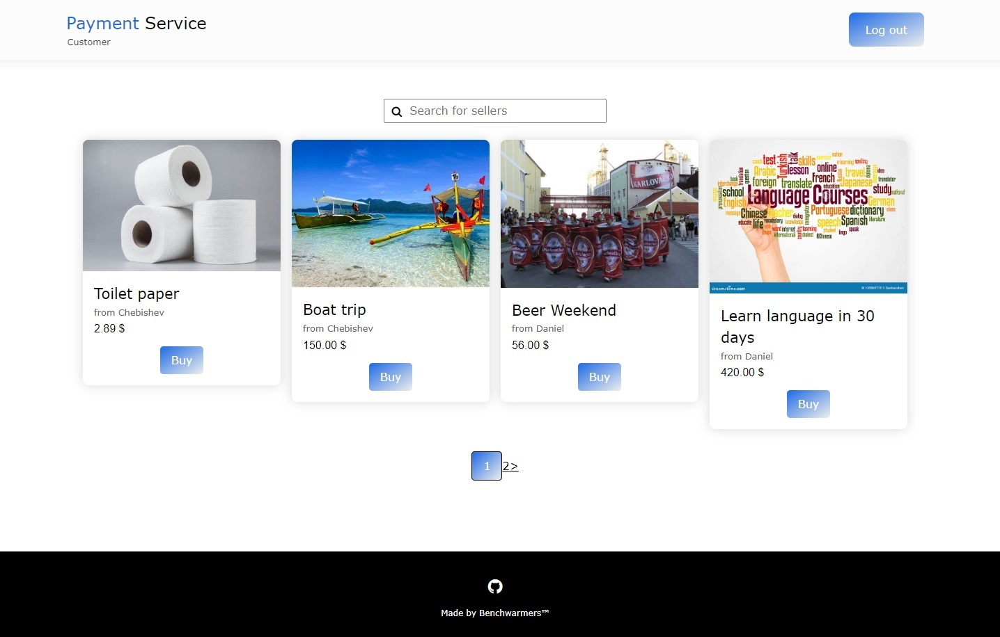
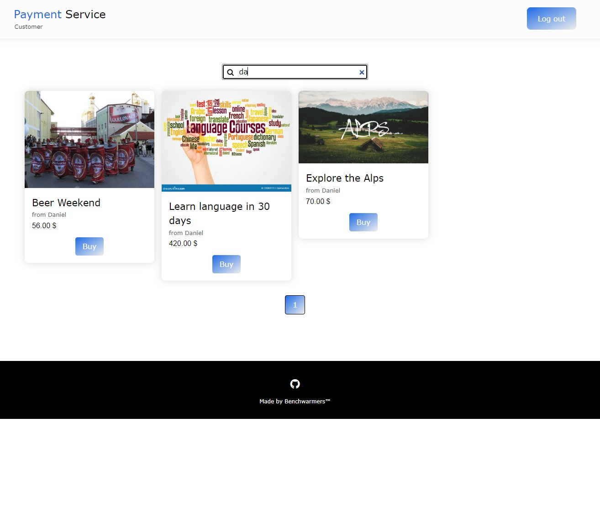
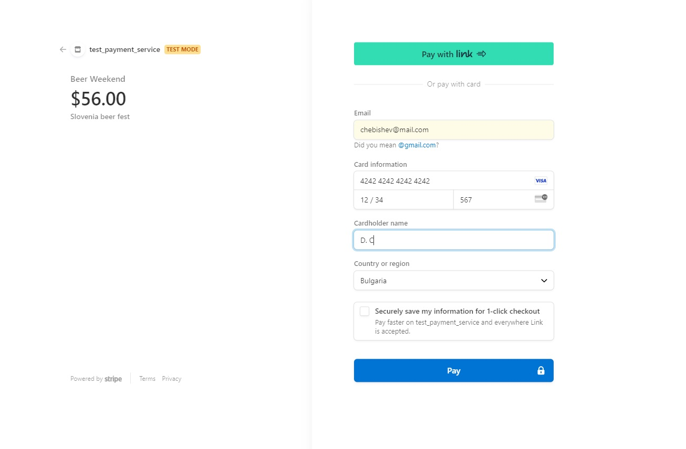
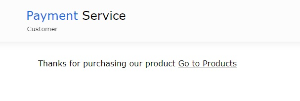
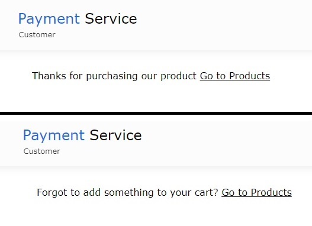

# Welcome to our Payment Service Solution

Things that you need in order to test the payment systems:
- For Stripe you can use one of the 3 provided test cards:
 1. 4000000000009995 - Failed payment
 2. 4000002500003155 - Requires authentication (3D)
 3. 4242424242424242 - Successful payment
 (use date in the future like 12/34
 any 3 numbers as CVC)

- For Coinbase (there is no sandbox there) you need real crypto in order to make
successful payment.

If you want to build the app you need to have StripeCli: https://stripe.com/docs/stripe-cli
stripe login (for loging into your Stripe account)
stripe listen --forward-to localhost:8000/webhooks/stripe/ (to get webhook key and to listen for successful or not payments)

The database is postgres, you need .env file on the level of manage.py
