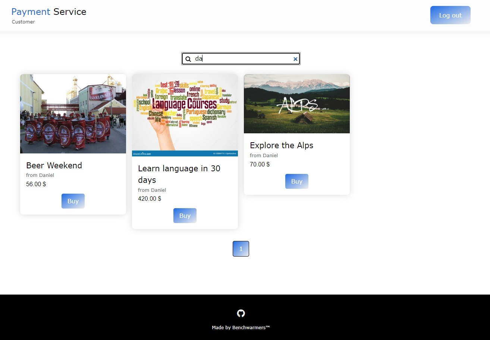

# Welcome to our Payment Service Solution
It is a web app build in less than 48 hours as a part of SOFTUNI CREATIVE FEST 2023 (https://fest.softuni.bg/)
It offers business and consumer types of accounts.
Business part allows sellers to publish offers and services
Consumer part shows all the active offers, allows search by seller name or part of it.
Whe consumer wants to pay for an offer or service, he can choose between two payment methods (Stripe and Coinbase)
There are also some statistics that business part can show to its users.
The app is entirely writen in Django framework. It has responsive design and uses PostgreSQL as a database. 
It can be easily switched to any of these too:
Officially supported: MariaDB, MySQL, Oracle, SQLite
3rd party: CockroachDB, Firebird, Google Cloud Spanner, Microsoft SQL Server, Snowflake, TiDB, YugabyteDB

Consumers home page screenshots:

Things that you need in order to test the payment systems:
- For Stripe you can use one of the 3 provided test cards:
 1. 4000000000009995 - Failed payment
 2. 4000002500003155 - Requires authentication (3D)
 3. 4242424242424242 - Successful payment
 (use date in the future like 12/34
 any 3 numbers as CVC)

- For Coinbase (there is no sandbox there) you need real crypto in order to make
successful payment.

Messages that consumer will see on successful or failed(cancelled) payment:

If you want to build the app you need to have StripeCli: https://stripe.com/docs/stripe-cli
stripe login (for loging into your Stripe account)
stripe listen --forward-to localhost:8000/webhooks/stripe/ (to get webhook key and to listen for successful or not payments)
Also you will need Stripe publishable and secret keys and Coinbase API in order to get real and successful payments.

Hope you'll enjoy it!
